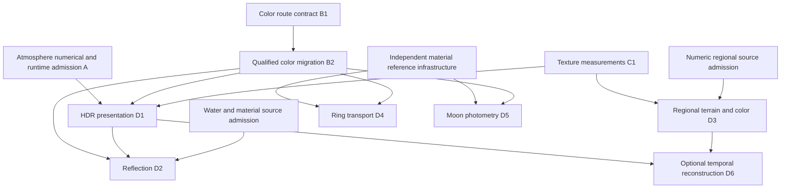

# Advanced rendering slice specifications

Status: individual specifications and admission boundaries. The original source
inspection is pinned to `bd7f5b45798a754c409e4b265e15703dad018f84`; primary source pages
were checked on 2026-09-13. Subsequent implementation records below supersede that
baseline only for their named slices. This document does not authorize release.
RFC 0004 and RFC 0005 retain their existing Accepted status and individual
qualification requirements; RFC 0006 is Accepted for its design and work sequence.
Its status does not admit an unfinished slice or replace source-specific gates.

The [D1 implementation record](HDR_IMPLEMENTATION_RESULTS.md) documents the opt-in
HDR runtime, GPU composition evidence and remaining application/native gates.
The [advanced material evidence](ADVANCED_MATERIALS_EVIDENCE.md) records the D3
source-derived v2 Moon/Mars terrain and the D2/D4/D5 reference helpers. Those
helpers do not enable reflection, revised ring transport or calibrated moon
brightness. Their independent source requirements below remain prerequisites.
Temporal reconstruction remains deferred. The current-frame scattering runtime
has its own [integration and qualification record](SCATTERING_RUNTIME_INTEGRATION.md).

## Shared integration and admission contract

The current implementation uses native ES modules, WebGL2, bounded workers, immutable
same-origin assets and independent Python/Node/browser validation. Preserve those
interfaces, engine snapshots, source dates, physical positions, radii and orbits.
Display inflation must not enter illumination, terrain height or physical shadow
calculations. Earth and Mars are the only admitted reference atmosphere profiles;
Venus, Titan and giant-planet atmospheres retain their disclosed illustrative modes.

| Existing surface | Role in a future change |
| --- | --- |
| `apps/web/js/orrery.js`: `paint`, `drawBody`, `drawMoons`, `drawRing`, `drawSolarReference` | Explicit render routing and final presentation; preserve all material and fallback routes. |
| `orrery.js`: `initGL`, `ensureSized`, `leaveOrrery`, context lost/restored handlers | Allocate by live context generation, cancel obsolete demand, release partial groups, recreate from admitted inputs. |
| `apps/web/js/orreryShaders.js`, `atmosphereShaders.js`, `atmosphereOptics.js` | Material transfer, distinct incident/view transport and exposure; do not retune existing numerical profiles. |
| `apps/web/js/terrainAssets.js`, `terrainGeometry.js`, `terrain.worker.js`, `terrainWorkerClient.js` | Numeric datum admission, physical geometry/normals, bounded work and latest-demand publication. |
| `apps/web/js/referenceDemand.js`, `physicalRendering.js`: `createDetailCache` | Existing cancellation/retry/cache semantics; new byte budgets must account for simultaneous old and new entries. |
| `apps/web/visual-assets.v1.json`, `terrain-assets.v1.json`, `tools/build_web.py` | Existing inventory and release binding; new versions are explicit and preserve old immutable assets. |
| `tools/earth_spin_probe.mjs`, `tools/browser_validation.mjs` | Final visible Earth submission, real GPU transforms, negative control and unchanged three-draw/five-second contract. |

Each future resource reports `deferred`, `loading`, `ready` or `unavailable`, its
immutable input identity, context/demand generation and bounded fallback reason.
Cancelled completion cannot upload or mark a replacement context ready. Allocation
failure releases every companion created during that attempt. An explicit retry
reuses the same selected source and starts one request group; paint cannot retry in a
loop. Leaving the view cancels pending work. Ready resources may remain only within
the declared budget. No new runtime provider, package, telemetry or background service
is part of these designs.

All numerical thresholds below are proposed engineering acceptance thresholds for
synthetic/reference tests, not measured asset accuracy or device-performance claims.
Record immutable build SHA, settings, source and derivative hashes, viewport, browser,
GPU/capabilities, sample domain, failed cases and resource counters with each receipt.
Retain failed receipts. Screenshots supplement numerical observables; they do not
establish calibration.

## Dependency graph and decision state



C2 texture compression is optional: neither tiling nor HDR requires compressed assets.
The graph describes prerequisites for enabled runtime features. Synthetic reference
functions, schemas and validators for D2-D5 can be developed independently before
source admission. D6 is deferred and is not a prerequisite for D1-D5.

| Slice | Implementable without new source acquisition | Held prerequisite for enabling |
| --- | --- | --- |
| D1 HDR | Resource manager and deterministic transfer fixtures after B1/B2 interface agreement. | Qualified linear routes, final presentation instrumentation, full resolution allocation and native/hosted runtime evidence. |
| D2 reflection | Pure GGX/Fresnel reference and synthetic shader fixture. | Registered water/material coverage, roughness/index model, baked-light treatment, held-out directional measurements and qualified D1. |
| D3 terrain/color tiles | Offline partition and reassembly tests using existing 0.25-degree source products. | Exact higher-detail product/label bytes, source quality and datum evidence, complete geometry/normal/shadow coverage and measured budgets. |
| D4 ring transport | Typed material/coverage model and independent mixture integrator. | Band-specific optical-depth or angular-transmission data with geometry, spatial support, uncertainties and independent tests. |
| D5 moon photometry | Disk integration, Lambert reference and current display corpus regression. | Per-body/band reflectance model and independent photometry covering declared phase/aspect domain. |
| D6 temporal | Written state/history contract. | Demonstrated need and independently measured history/rejection/motion costs after D1-D5. |

## D1: HDR scene composition and SDR presentation

### Goal and boundary

Retain values above one during scene composition, then apply one deterministic exposure,
tone map and output transfer. Initial output remains ordinary SDR sRGB. A floating-point
render target does not establish HDR-monitor output, absolute radiance, calibrated source
RGB or a physically comparable brightness scale across all display materials.

WebGL2 requires capability admission for a floating-point color attachment.
`EXT_color_buffer_float` makes RGBA16F color-renderable and permits unclamped fragment
outputs; multisample float support is optional. Require actual framebuffer completeness
and a write/read qualification probe in addition to extension presence.
[Khronos extension specification](https://registry.khronos.org/webgl/extensions/EXT_color_buffer_float/).

### Files and interfaces

Proposed new files are `apps/web/js/hdrPresentation.js`,
`apps/web/js/hdrPresentationShaders.js`, `tests/web/hdrPresentation.test.mjs` and
`tools/hdr_presentation_validation.mjs`. Integrate through the existing `paint`,
`initGL`, sizing and context handlers; material color changes remain owned by B2.

`createHdrPresentation(gl, {generation, maxBytes})` owns target creation and returns
`resize(width, height)`, `beginFrame(frameIdentity)`,
`present({exposure, frameIdentity})`, `status()` and `dispose()`.
`resize` returns a ready target or an explicit unavailable reason without changing
the canvas size. `frameIdentity` binds context generation, rendered epoch and scene
submission serial. `present` rejects a producer from a different identity.

The color contract must classify every contributing pass as linear reflected light,
linear emission, or a declared display signal converted once to linear display light.
Pass the upstream qualified atmosphere consumer's completed linear result into this
target; HDR itself does not change its quadrature, phase functions or tolerances.
Registered photos stay display references. Existing encodes inside materials must be
removed only through B2's per-route migration, never by a blanket upload-format edit.

The first implementation uses one full-canvas RGBA16F color texture and a compatible
depth attachment, no mipmaps, no history and no MSAA float target. Read the color with
`texelFetch`; float filtering is not assumed. Account eight color bytes plus a
conservative four depth bytes per pixel. The proposed incremental ceiling is 64 MiB
with maximum edge 2048, including simultaneously alive replacement targets. If a
full-resolution target cannot fit, retain the existing SDR path and report HDR
unavailable; do not lower texture, terrain or viewport resolution to pass a gate.
Resize releases the old HDR group before allocating a replacement and uses SDR while
unavailable. Empty frames or disposal release the group. These are allocation estimates,
not driver VRAM measurements.

Initial scope excludes scientific palette layers from HDR admission: when a sea-ice
palette is selected, use the existing SDR route for the whole frame and expose that
reason. This preserves the layer and its color scale. All other canvas passes,
including stars, rings, solar emission and guides, must have an explicit B2 route
before enabling HDR. DOM labels and controls remain outside scene tone mapping.

### Exposure and independent acceptance

`solarIrradianceScale(distanceAu)` remains `1 / distanceAu^2`. The current `drawBody`
passes `exposure = distanceAu^2` to reference optics. D1 must move display exposure to
one final stage. The first candidate uses a fixed exposure of one; a selected-reference-
distance policy is a separately selectable comparison fixture and remains disabled in
the initial runtime candidate. Material code must not apply that compensation a second
time. Neither policy turns source photos into flux measurements.

The first tone operator is the explicitly chosen componentwise display function
`mapped = x / (1 + x)`, where `x = max(linearScene, 0) * exposure`, followed by the
standard sRGB transfer. Reject nonfinite inputs before publication; do not hide NaNs
with tone mapping. Exposure is finite and nonnegative. Automatic histogram adaptation,
bloom, wide-gamut display output and temporal adaptation are separate proposals.

Acceptance requires:

- Float-target probes at 0, 0.18, 1, 4 and 16 retain pre-presentation values within
  binary16 rounding error. For each channel, the independent float64 presentation
  formula predicts final RGBA8 output within two code values.
- A unit reflected fixture at distances 1 and 2 has a pre-exposure ratio of 4:1;
  fixed exposure retains that ratio before tone mapping. The declared distance-squared
  display policy produces equality before tone mapping. Changing display body size
  leaves both physical flux and exposure inputs unchanged.
- Additive emission and alpha composition use linear values. Known dark, saturated,
  transparent/no-data and night-light fixtures detect double encoding or exposure.
  Scientific palettes route to the preserved SDR result.
- Missing extension, incomplete target, failed second allocation, rapid resize,
  zero-size view, leave/reenter and context loss release resources and preserve the
  existing usable SDR scene. Repeated cycles return tracked live allocations to baseline.
- The spin probe must bind a real final color-writing Earth consumer to a successful
  presentation of the same identity. An offscreen producer alone cannot pass. Freeze
  the final presentation while producers advance as a required negative control.
  Keep real GPU model/normal readback and the three draws within five seconds limit.

Rollback disables the D1 routing and disposes its target group, selecting the previously
qualified SDR shaders and exposure recipe together. Do not combine a reverted SDR
consumer with HDR-era exposure factoring.

## D2: rough-surface reflection and Earth glint

### Goal, source constraints and interfaces

Add a separately qualified direct-light reflection term. Source-based water geography,
microfacet roughness, refractive index and observed illumination are distinct inputs.
NASA's MOD44W is a water-classification product; it does not provide the roughness,
wind, waves, refractive index or cloud-free surface needed to qualify a glint model.
[NASA MODIS product description](https://modis.gsfc.nasa.gov/data/dataprod/mod44w.php).
Ocean directional reflectance depends on surface roughness and viewing geometry;
the published coupled atmosphere/ocean model also documents limits of roughness models.
[NASA-hosted ocean radiative-transfer research](https://ntrs.nasa.gov/api/citations/20080015519/downloads/20080015519.pdf).

Proposed files: `apps/web/js/surfaceReflection.js`,
`apps/web/js/surfaceReflectionShaders.js`, `tools/reflection_reference.py`,
`tests/web/surfaceReflection.test.mjs`, `tests/python/test_reflection_reference.py`
and `tools/reflection_validation.mjs`. Connect the material term inside the qualified
linear surface route in `orreryShaders.js`; `drawBody` owns explicit per-body enablement
and resets all reflection uniforms for every other material and moon.

An immutable `surface-reflection.v1` record must bind body, product ID, source/metadata/
derived hashes, size, grid and latitude conventions, registration, covered area,
water/land/ice/unknown classes, mask quality, source time and spectral interpretation.
It must independently bind the chosen refractive-index spectrum or declared RGB
approximation, roughness meaning and valid range, model/source identity, source
illumination treatment and supported incidence/view/phase domain. An illustrative
constant roughness must be explicitly named a scenario and cannot pass measured-glint
admission. Never infer water from blue RGB, roughness from image brightness, or cloud
optical depth from a cloud/surface composite. A photo with baked highlights cannot
silently receive a second calibrated glint term.

`evaluateReflection({normal, incident, view, alpha, nIncident, nMaterial})` returns
`{brdf, incidentCosine}` for finite unit vectors and positive refractive indices.
Directions point away from the surface. Nonpositive incident/view cosines yield zero.
The initial synthetic domain is `0.05 <= alpha <= 1`; alpha is microfacet slope width,
not a measured ocean parameter or a perceptual slider. Smaller slopes require a new
sampling/precision qualification.

Use the published GGX normal distribution and separable Smith masking with exact
unpolarized dielectric Fresnel, whose existing CPU reference is
`atmosphereOptics.js:dielectricFresnel`:

```text
h = normalize(incident + view)
D = alpha^2 / (pi * ((n.h)^2 * (alpha^2 - 1) + 1)^2)
G1(c) = 2*c / (c + sqrt(alpha^2 + (1-alpha^2)*c^2))
brdf = D * G1(n.incident) * G1(n.view) * F(incident.h)
       / (4 * (n.incident) * (n.view))
```

This is a bounded reflection model from
[Walter et al., microfacet theory and GGX](https://www.cs.cornell.edu/~srm/publications/EGSR07-btdf.pdf),
not a fit to Earth or a calibrated planetary BRDF. Handle a degenerate half vector
before normalization. A diffuse/specular mixture is a separate material record whose
combined energy must pass integration; do not simply add an arbitrary gloss lobe to
an existing photographic surface and call it calibrated.

### Composition, resources and acceptance

Reflection receives physical solar scale, local incident transmission and direct
visibility, followed by view transmission. Night emission receives view transmission
only. Atmospheric scattering remains a separate term. For Earth, enable only with
both admitted optical fields; otherwise retain the prior disclosed material. Clear
water, ice, land and source-unknown pixels must have distinct behavior. Unknown
classification disables the additional reflection term.

An initial prototype may hold at most one body's material set: one R8 classification
texture and one RGBA16F parameter texture, each at most 2048 by 1024 and with no mips.
The proposed incremental allocation ceiling is 24 MiB including decoded CPU data and
GPU data; the loader checks the combined peak before allocation. Exact file bytes,
channels and GPU format are inventory fields. Treat class masks as categorical data,
never ordinary color. If real source coverage/resolution cannot fit these bounds,
hold admission pending a measured tiled design; do not claim upscaled detail.

Acceptance compares actual shader BRDF values to an independently implemented float64
reference at incidence/view angles 0, 30, 60, 80 and 89 degrees, azimuths 0, 45, 90 and
180 degrees, and alpha 0.05, 0.2, 0.5 and 1. Proposed error is
`abs(gpu-reference) <= 1e-5 + 1e-3*abs(reference)` on the admitted domain. Require
reciprocity, nonnegative finite output, equal-index zero reflection and normal-incidence
Fresnel `((n1-n2)/(n1+n2))^2`. A separate converged hemispheric integration must show
reflected energy at most `1 + 1e-3`; reference integration convergence must be tighter
than `1e-5` before judging that bound. Synthetic indices 1 and 1.5 are test inputs.

Registration tests use a deliberately asymmetric categorical map, valid dark water,
ice and unknown cells, seams and poles. Test day/night, terrain normals, cloud/surface
source changes, eclipses, resource cancellation and context loss. Real-glint admission
requires held-out directional measurements in a stated band and source uncertainty;
set the empirical residual budget before fitting and do not reuse fitted samples as
external validation. None has been admitted by this document.

Rollback disables the material set, deletes its textures and restores the prior
qualified surface route. Source map, terrain and atmospheric profile identities stay
intact; no legacy display asset is overwritten.

## D3: regional numerical terrain and registered color tiles

### Source boundary and deterministic products

The current Moon and Mars numeric assets are 1440 by 720, at 0.25 degrees per cell.
Tiling these inputs can qualify mechanics but cannot add geological resolution. NASA
publishes other LOLA grids, while its CGI color product explicitly contains aesthetic
processing and filled coverage. A larger color file is not an elevation or scientific
reflectance measurement. [NASA Moon color/displacement product documentation](https://svs.gsfc.nasa.gov/4720/).
MOLA radius and topography products use different vertical meanings; the current source
uses radius, not height above the areoid.
[PDS MOLA product documentation](https://pds-geosciences.wustl.edu/missions/mgs/megdr.html).

Proposed files: `tools/prepare_terrain_tiles.py`,
`apps/web/js/terrainTileManifest.js`, `apps/web/js/terrainTiles.js`,
`apps/web/js/terrainTileGeometry.js`, `tests/python/test_terrain_tiles.py`,
`tests/web/terrainTiles.test.mjs` and `tools/terrain_tile_validation.mjs`.
Extend the existing terrain worker and demand orchestration with explicit tile requests;
retain the current whole-globe loader as an independently selectable fallback.

`terrain-tiles.v1` binds the original numeric product and labels, all source hashes,
body/frame, epoch/validity, horizontal projection, longitude/latitude conventions,
cell registration, vertical units/datum/reference radius, source interpolation and
quality flags. Each tile records integer source-cell bounds, level/parent/neighbors,
core and halo dimensions, encoding, no-data mask, derived hashes/bytes, conservative
height bounds and geometric error. Color tiles have independent source and derivation
identities and the same explicit mapping contract; color coverage cannot imply valid
height and height coverage cannot imply observed color.

The offline generator consumes already approved local originals and writes a new
task-local output directory plus manifest atomically. It performs no network calls.
Its source-to-tile recipe, version and generator hash bind the product. Unchanged
source cells must reconstruct exactly before optional quantization. If quantization
is used, declare its units and rounding and prove the maximum additional error.
Preserve originals and provider gaps; parent interpolation and halos are derived,
not new observations. Do not inpaint gaps or reinterpret producer-interpolated cells
as directly measured samples.

### Geometry, shadows and allocation

`selectTerrainTiles({body, view, sourceIdentity, budget})` returns a deterministic
ordered demand list with parent fallback coverage. `buildTerrainTile({tile, neighbors,
physicalRadii})` returns positions/normals/indices, conservative bounds and source
identity. Publish a replacement set only after geometry, normals, source masks and
shadow requirements agree on the same admitted source generation.

Proposed mechanical limits are 256 by 256 source-cell tile cores with a one-cell halo,
at most 32 resident source tiles, 128 mesh patches and 33 by 33 vertices per patch.
Require adjacent mesh levels to differ by at most one and use shared-edge stitching,
not downward skirts that create fictitious relief. Shared vertices/normals must derive
from identical integer source coordinates. Pole closure and longitude wrap remain
explicit. Source resolution, not a fixed advertised zoom level, bounds refinement.

Proposed incremental CPU ceiling is 48 MiB, GPU ceiling 64 MiB, with two transfers and
one worker build in flight. Admission sums compressed transfer, decoded height/mask/
color, worker output, GPU buffers and old/new overlap. Limit by both bytes and counts;
a count-only cache is insufficient. Existing whole-globe resources count separately
in the full-scene peak budget. Evict unused children before parents required for
fallback; abort obsolete demand and ignore late generations.

High-detail cast shadows need their own complete support: a source-bound min/max
hierarchy covers the whole ray domain and leaf samples provide the required detail.
An absent, masked or unresolved possible occluder is unknown, not transparent. If a
bounded query cannot establish visibility, retain the whole-body baseline terrain
and its existing shadow path for that frame. High-resolution silhouette/normals must
not be labelled fully qualified while shadows silently use an unrelated coarse field.
Directional-Sun semantics stay explicit. Finite-Sun penumbrae require a separate
angular integration and error/cost gate; they are not presumed subpixel at close views.

### Acceptance and rollback

- Reassemble all core cells and masks to the admitted source grid exactly, or within
  the declared added quantization error. Independently check datum anchors and extrema;
  reject an areoid/radius mismatch, duplicate tile, missing neighbor and mixed hashes.
- A synthetic constant-radius globe matches analytic radius/normals. A known ridge
  changes silhouette and shadows at the independently calculated location. Compare
  CPU physical geometry and actual GPU depth/normal/shadow readback, not color alone.
- Mixed-level seams and poles have identical shared boundary positions. A deliberate
  no-data cell cannot create a pit, bridge or occluder. Color-only missing coverage
  retains the declared simplified color without inventing source content.
- At fixed source, view and budget, demand ordering and selected mesh are repeatable.
  Zoom/rotate/cancel/context-loss tours stay within byte/count peaks and return live
  allocations to baseline. Existing camera clearance includes source extrema before
  detail arrives, with no ephemeris changes.
- Whole-app validation preserves source-map detail, physical shadow tests and the
  original final-Earth deadline. Actual device evidence decides whether the proposed
  budgets and tile/patch sizes are admissible; a source partition test cannot do so.

Rollback selects the current whole-globe terrain product, disposes the tile group and
retains original source archives and the immutable tiled derivatives for inspection.
No current product is replaced merely because a larger external product exists.

## D4: ring coverage and optical transport

### Representation and mathematical contract

The existing `orreryMath.js:ringOpacityProfile` averages piecewise band/gap opacity
over radial texel footprints. Its display opacities are not measured homogeneous
normal optical depths. The shader's half-texel edge factor is additional geometric
coverage. Preserve the existing appearance until a separately admitted replacement
has passed both transport and display tests.

Proposed files: `apps/web/js/ringTransport.js`, `tools/ring_transport_reference.py`,
`tests/web/ringTransport.test.mjs`, `tests/python/test_ring_transport_reference.py`
and `tools/ring_transport_validation.mjs`. `drawRing`, `ringShadowProfileTex` and the
ring-shadow block in `orreryShaders.js` are the only rendering integration surfaces.

The input discriminated union is one of:

- `display-opacity`: current source/display constants; no angular optical-depth claim.
- `resolved-mixture`: explicit radial subregions with nonnegative area weights summing
  to one; each is empty, opaque, or an independently admitted homogeneous depth.
- `angular-transmission`: measured transmission samples with band, illumination/view
  geometry, spatial footprint, uncertainty, saturation limits and interpolation domain.

For an admitted homogeneous subregion, `T_j(mu) = exp(-tau_j / abs(mu))`, where tau is
normal optical depth in the declared band. For a mixture, average **after** transport:
`T(mu) = sum(weight_j * T_j(mu))`. Empty gives one; opaque gives zero. Additional
coverage `m` yields `1 - m + m*T(mu)`. The formula requires the stated geometrical
support and does not imply that Saturn's structured rings behave as homogeneous slabs.

The mandatory counterexample is half opaque material plus half empty gap: transmission
is 0.5 at both mu=1 and mu=0.5 under that fixed footprint model. Converting average
transmission to a slab instead yields 0.25 at mu=0.5 and MUST fail the test. In general,
`E[T^(1/mu)]` and `E[T]^(1/mu)` differ. A homogeneous-slab scaling identity is tested
only within its unclamped domain; it is not a general mixed-footprint invariant.

Cassini archives provide occultation products and documentation, but an archive listing
does not admit a chosen profile. Radio, UV and visible transmission are not interchangeable.
The RSS guide documents resolution/noise/saturation tradeoffs; the ring science report
also describes wavelength and structural dependence.
[PDS Cassini RSS archive](https://pds-rings.seti.org/cassini/rss/),
[PDS Cassini UVIS archive](https://pds-rings.seti.org/cassini/uvis/),
[RSS users guide](https://pds-rings.seti.org/cassini/rss/Cassini%20Radio%20Science%20Users%20Guide%20-%204%20Sep%202014.pdf),
[Cassini ring science report](https://pds-rings.seti.org/cassini/report/Cassini%20Final%20Report%20-%20Volume%201%20-%20Rings.pdf).

### Bounded candidate and acceptance

Begin with a CPU reference using at most 256 explicit radial subregions. A future
angular lookup is at most 2048 radial by 64 angular samples in R32F, one resident
body at a time, with a 4 MiB combined CPU/GPU/temporary budget. It binds original
subregion data and generator hashes. Sampling within each footprint integrates the
retained distribution before storing transmission. Never derive it by exponentiating
the old averaged opacity texture. Actual interpolation error decides admission.

Proposed initial angular support is `0.02 <= abs(mu) <= 1`. Unsupported grazing
geometry retains the declared display fallback. Do not silently lower the current
ray-plane denominator guard; parallel rays, annulus edges, finite intersections and
floating-point precision require independent geometric tests first.

Test exact empty/opaque/half-opaque mixtures, homogeneous tau=log(2), additional
half-coverage, translated ring/planet geometry, both ring-plane sides, narrow bands,
annulus boundaries and invalid values. Independent float64 transmission and GPU
lookup must agree within `1e-4 + 1e-3*abs(reference)` on the admitted domain. Test
the distribution counterexample independently of the generator implementation.
Planet-to-ring and ring-to-planet visibility must use the same source geometry and
preserve existing source gaps. Reflected ring brightness, single/multiple scattering
and phase functions are separate from transmission; a darker shadow alone cannot
qualify a ring BRDF. Per-band held-out profile residuals and source uncertainties must
be declared before fitting any actual profile.

Rollback selects the prior `display-opacity` route and releases the optional lookup.
Original band geometry and opacity records remain unchanged and inspectable.

## D5: moon display compatibility and physical photometry

### Observable and input contract

Retain `moonAppearance.js:moonAlbedoGain` and `moonBaseColor` as the existing relative
display recipe until a separate model is qualified. It uses an encoded brightness gain
and hue normalization, while mapped moons add source contrast and lighting. A refit
to image means would change that convention without establishing physical albedo.

Geometric albedo is zero-phase disk-integrated brightness relative to an equally sized,
unit-reflectance Lambertian flat disk perpendicular to the illumination, at the same
illumination and observer distances. It is not a map mean, nor necessarily bounded by one.
[JPL geometric-albedo technical definition](https://ssd.jpl.nasa.gov/glossary/albedo.html).
Lunar calibration work explicitly treats disk integration, phase, libration and band
response; its success does not calibrate the other satellite display mosaics.
[USGS ROLO model description](https://www.usgs.gov/centers/astrogeology-science-center/science/rolo-further-details-lunar-calibration).

Proposed files: `tools/moon_photometry_reference.py`,
`tests/python/test_moon_photometry_reference.py`, `tests/web/moonPhotometry.test.mjs`
and `tools/moon_photometry_validation.mjs`. Only after source admission add
`apps/web/js/moonPhotometry.js` and a separate material route in `drawMoons`/
`orreryShaders.js`; do not overwrite the existing display table or source map mode.

`moon-photometry.v1` binds body, photometric band/response, source/metadata hashes,
shape/reference radius, body attitude and its validity, illumination/view geometry,
permitted phases and aspects, reflectance law and parameters/uncertainties, map
registration and no-data, photometric normalization history and independent evidence
IDs. Catalog values without band, uncertainty or observation geometry remain context,
not sufficient calibration data. Current fixed reference map orientation is not a
time-dependent body-attitude model. Io source-RGB mode 5, monochrome mode 4, Titan's
illustrative haze and simplified unmapped moons must remain distinct cases.

The reference computes `integral(L_o * max(n.view, 0) * dA)` over visible geometry,
with illumination and BRDF inside `L_o`; normalize by the specified comparison disk.
Coverage-aware integration reports separately observed contribution and unresolved
area. It must not renormalize partial coverage to a complete globe or count a no-data
pixel as a measured black surface. A physical calibration result is held when the
required illuminated/visible contribution is unresolved.

### Independent tests and bounded runtime

Use an analytic Lambert sphere with diffuse reflectance rho: its geometric albedo is
`2*rho/3`, and its normalized phase curve is
`(sin(alpha) + (pi-alpha)*cos(alpha))/pi` for `0 <= alpha <= pi`.
This provides an oracle independent of texture averages and the renderer's shader.
Require converged float64 integration within `1e-4` absolute on synthetic rho=0.1,
0.5 and 1 and phases 0, 30, 60, 90, 120, 150 and 180 degrees; verify convergence
with a finer independent quadrature. Compare actual GPU pre-exposure disk sums with
the reference to `1e-3` relative plus `1e-5` absolute in normalized units, reporting
pixel coverage/raster error separately. A negative control that averages the map must
fail the Lambert `2/3` zero-phase result.

Add asymmetric bright/dark hemispheres with multiple orientations, valid black cells,
partial masks and band distinctions. Capture the full current admitted moon corpus,
including Io mode 5 and simplified materials, for display-compatibility testing.
Rounded equal catalog values do not require equal image means at every orientation.
Use held-out observed epochs/aspects to qualify real models; fitted images are not
independent evidence and empirical tolerances cannot be chosen after seeing residuals.

Initial runtime admission allows one optional per-body uniform parameter record up to
4 KiB and reuses already admitted bounded textures. A model requiring new maps or
angular tables must declare and qualify those products and allocations separately.
No per-frame parameter fitting, source acquisition or full-disk integration runs in
the renderer. Measurement tools integrate offscreen fixture output within explicit
sample and framebuffer budgets; those tools do not claim application frame rate.

Rollback selects the preserved display recipe and unloads the optional parameter
record. Reference images, source epochs, eclipse geometry, catalog constants and
engine state remain unchanged.

## D6: optional temporal reconstruction, deferred

Do not add TAA to hide unconverged transport, coarse source detail or shader errors.
A future proposal must define history color/depth/validity formats and their full
allocation cost, physical/display motion vectors, camera cuts, resize/context resets,
disocclusion and coverage rejection, source/epoch/generation changes, moving clouds
and solar playback, transparent rings, pause/reduced-motion and maximum history age.
Deterministic single-frame references remain available. Frozen-history and stale-source
negative controls must fail while genuine final presentations satisfy the original
spin deadline. No current cost or performance benefit is asserted.

## Execution sequence, validation and handoff

For each slice, first add its independent synthetic/reference tests and observe the
deliberate negative controls failing. Implement the smallest pure interface next;
then add bounded resources and actual shader readback. Admit real source products
only after the input contract and independent evidence are complete. Finally qualify
the whole staged application, including all prior material and fallback routes, before
enabling that slice. Each slice is independently revertible; none authorizes a combined
unreviewed visual retune or source inventory replacement.

Existing commands available to an implementing change include:

```powershell
npm test
python tools/typecheck_web.py
python tools/validate_visual_assets.py
python tools/validate_physical_assets.py
python tools/validate_docs.py
python tools/validate_sdlc.py
node --test tests/web/terrainGeometry.test.mjs tests/web/terrainAssets.test.mjs tests/web/rings.test.mjs
python -m unittest discover -s tests/python -p test_terrain_reference.py
node tools/planet_appearance_validation.mjs --web-root=build/advanced-candidate --out=coverage/advanced-planet-candidate
node tools/ring_appearance_validation.mjs --web-root=build/advanced-candidate --out=coverage/advanced-ring-candidate
node tools/terrain_shadow_validation.mjs --web-root=build/advanced-candidate --out=coverage/advanced-terrain-candidate
node tools/physical_rendering_validation.mjs --web-root=build/advanced-candidate --out=coverage/advanced-physical-candidate --context-loss
```

The example staged directory must already contain an immutable build; create unique
evidence directories for each run. The proposed new tests/tools above are planned
files, not commands claimed to exist or pass. Run repository browser coverage and
hosted checks under their existing budgets as required by the integrating change.
This specification does not establish full scientific, native-device or release
qualification. The [D3 implementation record](ADVANCED_MATERIALS_EVIDENCE.md)
documents the live source-derived whole-globe v2 Moon/Mars terrain; regional tiles
and finer photographic maps remain unimplemented. The
[D1 implementation record](HDR_IMPLEMENTATION_RESULTS.md) documents the opt-in HDR
runtime, separately from its current combined-source application admission in the
[production ledger](PRODUCTION_EXECUTION.md). Calibrated reflection, revised
angular ring transport and per-body calibrated moon photometry remain held for
their independent source and accuracy requirements. Temporal reconstruction is
deferred.
