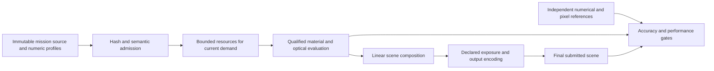

# Rendering qualification and implementation sequence

Status: active qualification, not release approval. Starting revision:
`bd7f5b45798a754c409e4b265e15703dad018f84`. Scope comes from the user's accepted
four-part follow-up to the independently assessed SOL Audit v5.

## Problem, scope and invariants

SOL needs consistent, source-grounded lighting without weakening its scientific
or runtime contracts. The current Earth/Mars scattering integration remains
expensive per final fragment, and a bounded-field experiment failed independent
interpolation checks. Color paths have different display conventions. Texture
inventory is known, but actual allocation and stage timings need measurement.

The work extends [RFC 0004](../../rfcs/0004-registered-planetary-appearance.md) and
[RFC 0005](../../rfcs/0005-physical-rendering.md). Their accepted status does not
automatically admit new optical models, assets, exposure rules or render passes.
Requirements `SOL-VIS-004`, `SOL-VIS-005`, `SOL-VIS-006`, `SOL-ARCH-001` and
`SOL-SCI-001` remain controlling. Existing engine snapshots, uncertainty,
ephemerides, physical centers/radii and orbits are unchanged by this plan.

- Preserve original source bytes, hashes, coverage, observation epochs and credits.
- Preserve the existing numerical tolerances, texture/terrain detail and original
  three accepted final Earth draws within five seconds performance contract.
- Keep radiative flux separate from viewing exposure and image color recipes.
- Do not invent water masks, roughness, DEM relief, weather or calibrated albedo.
- Preserve latest-demand cancellation, bounded caches, context restoration and
  explicit retry. Failure remains visible; unqualified resources stay disabled.
- No new runtime provider, dependency, telemetry or background service is required.

## Context map and ownership

| Surface | Current owner / inputs | Change boundary |
| --- | --- | --- |
| Optical transfer | `atmosphereShaders.js`, `atmosphereColumnField.js`, profile-bound fields | Qualify terrain endpoints and analytic integration boundaries before bounded interpolation. |
| Surface color | `orreryShaders.js`, `planetAppearance.js`, `moonAppearance.js` | Document every route; independent transfer/filter/material fixtures precede migration. |
| Image demand/upload | `referenceDemand.js`, `orrery.js` image loader and uploader | Measure decode, resize, upload, mip construction and lifetime independently. |
| Terrain | `terrainAssets.js`, `terrainGeometry.js`, worker, registered numeric products | Preserve datum, source cells, shared boundaries and physical displacement. |
| Frame composition | `orrery.js` opaque/translucent passes and context lifecycle | HDR needs one explicit output conversion plus qualified fallback and resource budgets. |
| Ring/moon photometry | `orreryMath.js`, `moonAppearance.js`, material shader | Separate spatial coverage from transmission; define a disk-integrated observable. |

The [color contract](COLOR_PIPELINE.md), [texture pipeline](TEXTURE_PIPELINE.md)
and [qualification results](QUALIFICATION_RESULTS.md) define the current routes,
measurements and remaining gates. The [advanced rendering specification](ADVANCED_RENDERING_SLICES.md)
separates the later runtime changes. Review tooling and evidence live outside the renderer
until a slice passes its admission gates.

## Architecture and data flow



The diagram defines the target separation. It does not assert that every current
material already uses linear scene composition or an HDR target.

For each new resource, use the existing lifecycle:

```text
deferred -> loading -> ready
                  -> unavailable --explicit retry--> loading
loading --obsolete demand/context loss--> cancelled -> deferred
ready --eviction/context loss--> deferred
```

Generation and resource identity must agree before a completion becomes visible.
A cancelled request cannot upload late. Disposing an incomplete group releases its
companions. A fallback has its own declared semantics; it is never counted as an
enabled physical sample by an acceptance probe.

## Reviewable implementation slices

| Slice | Concrete deliverable | Dependency / promotion gate |
| --- | --- | --- |
| A1: terrain-endpoint reference | Explicit endpoint-preserving float64 reference and analytic/convergence fixtures; preserve the old ground-clipped oracle by default. | Invalid-input, vacuum, datum crossing, polar/oblate, day/night and shadow-boundary tests. |
| A2: segmented integration | Candidate splitting at analytic ground roots, closest approach and lit interval boundaries; finite work bound. | Original GPU suite plus independent A1 comparisons. Do not infer frame-time improvement from numerical correctness. |
| A3: bounded scattering | Camera-ray coordinates aligned with the qualified boundaries; fixed allocation and work budgets. | Entire retained 5,592-point domain matrix, full materials/raster, unchanged browser deadline and hosted CI. The prior tensor-field experiment is not an accepted design. |
| B1: color contract | Exhaustive route/fallback matrix and decode/filter/shade/encode regression fixtures. | Known-color, night emission, palettes, alpha, valid-dark/no-data, seam, pole and mip tests. |
| B2: color migration | One explicit color-data classification and one decode/output encode per intended path. | Pixel qualification on admitted and fallback materials; retain scientific palettes and source interpretation. No blanket format change. |
| C1: measured texture pipeline | Repeatable staged-source profiler, capability inventory, per-stage timings, allocation accounting and filter fixtures. | Exact asset/source binding; CPU durations and GPU completion delays reported separately; memory estimates labelled. |
| C2: derived texture admission | Deterministic source-to-derived products only where C1 demonstrates benefit. | Source + derivative hashes, dimensions, color/alpha/coverage policy, capability fallback, image-error and lifecycle gates. |
| D: advanced rendering | Separate HDR, reflection, DEM tiling, ring and moon photometry specifications and changes. | Each has its own independent reference and resource/rollback contract; no shared catch-all visual patch. |

A1/A2, B1 and C1 can proceed independently. A3 consumes the qualified numerical
reference; B2 consumes B1 and measured filtering behavior. C2 is evidence-driven,
not a requirement to convert assets regardless of measurements. Advanced slices
must declare their precise dependencies before implementation.

## Failure handling, rollback and observability

Use deterministic bounded fixtures before application tests. Capture source SHA,
per-file hashes, browser/GPU capabilities, settings, dimensions and monotonic
timings with each local receipt. Keep failed receipts and never overwrite an
immutable run directory. Do not log user location, credentials or private data.

An allocation, compile, hash, capability or qualification failure retains the
existing supported renderer. Do not claim physical transport while showing that
fallback. Changes to capability selection must be exercised through context loss,
restore, rapid selection, retry, leave/reenter and partial group failure.

Each published slice must be independently revertible without regenerating engine
state or replacing original source products. New derived assets use versioned
identities; a rollback selects the prior identity rather than overwriting bytes.
Release promotion remains separate from commit, local success and hosted CI.

## Test matrix and evidence requirements

| Scenario | Level | Required result |
| --- | --- | --- |
| Signed endpoint, tangency, empty interval, sphere/oblate, near/far camera | Float64 + actual GPU | Finite values; declared endpoint retained; analytic/converged reference agreement. |
| Ground/density and shadow crossings | Analytic fixtures + GPU | No integration across an unsegmented density kink; no false shadow leakage; finite node bound. |
| Material ready/loading/missing, surface/cloud/night/palette/moon | Renderer harness + GPU pixels | Correct route, no double decode, no implicit source reinterpretation. |
| Filter, alpha, resize and mip boundaries | Synthetic GPU fixture + source image | Measured transfer matches the declared convention; scientific palette values unchanged. |
| Texture demand and resource lifetime | Instrumented app + unit tests | Existing residency/concurrency bounds, cancellation and disposal preserved. |
| Normal scene, focused Earth/Mars, source Sun and terrain | Immutable staged app | Existing visual/scientific gates, original animation deadline and context recovery pass. |
| Release candidate | Full existing CI | No excluded runtime coverage, weakened threshold or rerun substituted for diagnosis. |

Use the repository's Node tests, `python tools/typecheck_web.py`, documentation,
SDLC and UX validators. GPU qualification uses the existing atmosphere, terrain,
physical-rendering and browser tools plus narrowly scoped new fixtures. Run native
device checks separately from Chrome/SwiftShader and report both honestly.

## Decisions and open evidence

1. The user accepted this sequence and its accuracy constraints. Routine reversible
   qualification work proceeds without another permission round.
2. Do not transplant the unqualified scattering candidate. Its 368 failures remain
   evidence against that implementation, despite successful local timing checks.
3. Keep the original clipped Python reference; expose terrain-endpoint semantics
   explicitly so a changed oracle cannot silently make old tests pass.
4. Do not infer a VRAM bottleneck from the 24-file inventory or a fixed cache limit.
5. No calibrated reflection or photometry claim follows from display-image fitting.
6. Engineering and scientific-visual review apply. New security/authentication,
   deployment and product-navigation review phases are unnecessary for this scope:
   no such interfaces or authority boundaries are being introduced.

Completion is per slice. A report or qualification harness is not a claim that HDR,
new textures, physical giant-planet atmospheres or bounded scattering is enabled.
