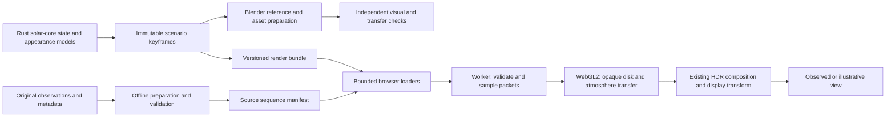

# Dynamic Sun implementation plan

Status: proposed implementation plan; no application implementation or release approval.
Prepared: 2026-09-23. Baseline: `Protonmatter/sol`, `master` at `88bfb852a9b19a101a59c5053c53bccf60c1aea1`.

Build a Sun that remains coherent from every viewing direction and evolves at an explicit rate, with its visible photosphere, chromosphere, corona, magnetic structures, and observational channels represented according to their different physical meanings. Keep the measured Sun and an illustrative three-dimensional Sun clearly identifiable.

The deliverable is a staged engineering design, including implementation boundaries, equations, file changes, data contracts, algorithms, rendering passes, Blender workflow, failure handling, resource budgets, tests, and release conditions. Values marked **design target**, **illustrative**, or **proposed tolerance** are engineering choices to validate, not established performance or empirical calibration.

## Read in this order

1. [Problem and scope](problem-and-scope.md): product contract and acceptance IDs.
2. [Context map](context-map.md): actual code, constraints, and current defects.
3. [Science and mathematics](science-and-math.md): layers, coordinates, evolution, transfer, and limits.
4. [Display and rendering design](design-review.md): what users see and the browser rendering pipeline.
5. [Developer and data contracts](devex-review.md): schemas, worker/API boundaries, assets, validation and build integration.
6. [Blender pipeline](blender-pipeline.md): scene design, reference renders, interchange, and local feasibility.
7. [Engineering plan](engineering-plan.md): ordered implementation slices, exact files, failure handling, rollback and commands.
8. [Test matrix](test-matrix.md): numerical, visual, temporal, browser, device and evidence gates.
9. [Decision log](decision-log.md): resolved choices, alternatives, and remaining external evidence.
10. [Sources](sources.md): NASA references supplied by the user and supplementary primary technical sources.

## Architecture in one view

Blender is an offline consumer of the same scene inputs as the browser. It is not the authoritative physics engine and is not required on the user's phone. A Blender material graph is not automatically a browser shader.

## Proposed initial product

- Preserve the main **The Sun > Observe** experience and its original source imagery. Add genuine sequence playback there without changing the meaning of the existing Research model.
- In **Solar System > The Sun**, replace the problematic half-observed default with **Illustrative 3-D — corona / 171 Å style**, featuring full-sphere structure and explicit modeled time. Retain an accessible **Observed Sun** switch and a separately named **Legacy AIA reference** during migration.
- Provide **Visible photosphere**, **Corona / 171 Å style**, and **Layers** initially. Add observed 304/193 channels when source bundles are available; add the illustrative cool-plasma and extended-corona layers after their transfer tests pass.
- Keep all scientific results in Rust/offline qualified products. Browser procedural evaluation is limited to rendering declared appearance fields; it must not create measured density, temperature, magnetic strength, forecast probabilities, or new observed data.
- Keep bloom subordinate to resolved structure. Do not use a global pulse as the principal motion cue.

## Blender assessment

Blender can improve composition, volume appearance, geometric continuity, and reference image quality. Use Cycles for offline reference integration and EEVEE for interactive scene inspection. Export numeric assets and explicit geometry; retain native WebGL2 shaders for the application.

On this host, bounded checks found no Blender executable on PATH, no Blender entry in the checked uninstall registries, and no installation at the checked standard Program Files, local Programs, or Scoop paths. The OS reports ARM64 and a Qualcomm Adreno X1-85 GPU. This is not proof that no portable copy exists anywhere. Blender's official Windows-on-Arm report supports evaluating EEVEE with Vulkan; Cycles GPU support on this device is not established. Plan a CPU Cycles smoke render first once Blender is provisioned. No installation, scene build, or Blender rendering was performed in this planning task.

## Sequencing and effort

Implement S0–S10 in [engineering-plan.md](engineering-plan.md). The core path is contracts → deterministic appearance fields → field-aligned coronal geometry → bounded transfer → UI integration → acceptance. Observed sequencing and Blender authoring consume the same contracts and can be scheduled alongside implementation once those contracts stabilize; this is scheduling guidance, not a request to spawn agents.

Planning estimate: approximately **50–85 engineering working days** for the complete initial scope, including observed playback, reduced-model 3-D rendering, Blender pipeline, and device hardening. Allow **5–10 additional specialist review/qualification days**, which may overlap. These are task-sizing estimates, not a delivery commitment. Source availability, instrument calibration, physical-device access, and visual review can dominate elapsed time. Full radiative MHD and quantitatively calibrated multi-channel plasma inference are separate research projects.

## Review outcome and evidence boundary

Product, design, architecture, developer-experience, input/resource safety, and test reviews are included. Identity/tenant/credential reviews are inapplicable because this design adds no accounts, remote location transmission, or production identity changes. All future network acquisition and tool provisioning remain explicit operations; the shipped renderer uses admitted same-origin static bundles.

Planning validation covers current source paths, cross-document references, acceptance-to-test coverage, basic numeric examples, and diff hygiene. It does not establish shader compilation, solver correctness, Blender execution, device performance, or completion of implementation slices. Earlier read-only findings are available in the workspace report `sun-research-20260923/SOLAR_VISUAL_RESEARCH.md`; they are evidence, not a substitute for this plan's future acceptance gates.
