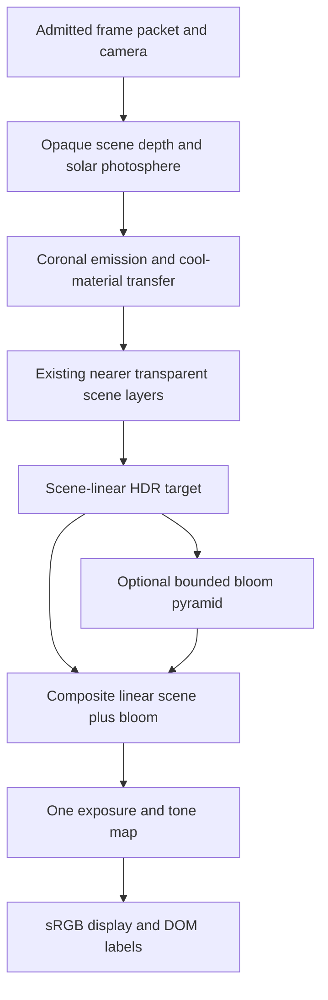

# Display, interaction and rendering design

## 1. View contract

Preserve the main Observe destination as original observed imagery. In Solar System Sun inspection, default to **Illustrative 3-D · Corona / 171 Å style** once the new feature is qualified. This default provides coherent structure around the entire sphere without pretending to be a simultaneous whole-Sun observation.

The mode switch offers **Illustrative 3-D**, **Observed Sun**, and initially **Legacy reference**. The legacy entry retains the existing behavior for comparison/rollback; it is not silently converted into a new dataset. Research/model controls remain accessible. Selecting a channel does not turn an illustration into an observation.

The viewport should occupy the useful screen area without burying controls under a long explanation. At mobile widths, place a two-row control strip directly below it: mode/channel, then play/pause, elapsed/source time, rate, and a Layers button. Keep short state text visible; move equations/provenance into the inspector. Use native buttons, selects and range inputs where possible. Large touch targets and clear focus must survive 320 CSS pixels and 200% zoom.

Initial behavior is explicit: first entry into the new illustrative inspection starts at scenario time zero at 60x when reduced motion is not requested. Observed sequences initially remain paused with a prominent Play action. User pause persists during that session's navigation/mode switches. Backgrounding or enabling reduced motion pauses the active experience; returning to the foreground does not restart it automatically. A new explicit scenario selection resets to its start and follows the user's current paused/playing preference.

Proposed text examples:

- `Illustrative 3-D · 171 Å style · 60× time`.
- `Observed · SDO/AIA 171 Å · 2024-05-10 12:00 UTC · archive`.
- `Paused · fine detail averaged at this speed`.
- `Sequence ended · Replay`.
- `Source unavailable · last verified frame retained`.
- `Reduced motion · paused; use the time slider`.

Remove the fixed center-of-disk Sun label in inspection mode once the adjacent title identifies the object. Keep selection labels in the system overview. This is a small contextual change, not global label removal.

## 2. Layer controls and presets

| Control/preset | Enabled content | Exposure and interpretation |
|---|---|---|
| Visible photosphere | Opaque continuum, spots, faculae, scale-filtered granulation | Neutral white; restrained bloom; ordinary exterior view. |
| Corona / 171 style | Occulting photospheric boundary, relative EUV disk/volume emission, field-related loops, quiet diffuse corona | Gold scientific false color; channel-relative exposure independent from visible mode. |
| Observed 171/193/304 | Original admitted frames and metadata | Preserve source intensity interpretation and off-limb content; no added synthetic active regions. |
| Magnetic structure overlay | Selected traced field lines, polarity/units legend | Initially off; lines are model geometry, not luminous tubes automatically. |
| Cool plasma | Qualified illustrative prominence/filament transfer or actual observed channel | Clear model label; unsupported layer disabled with a reason. |
| Extended corona | Larger-domain streamers/plumes | Sun-inspection-only framing; separate exposure/scale; normal disk may be explicitly occulted. |
| Layers cutaway | Interior layers plus atmosphere ordering | Schematic scale disclosure; no live-observation label. |

Do not allow an arbitrary collection of incompatible channel layers to masquerade as one photograph. A multi-channel composite must explicitly identify all component channels, source times, blend recipe and image registration. Initial release supports single-channel presets plus separately labeled explanatory overlays.

## 3. Camera and scale

- Model view supports a complete orbit, pole views and close-up patches. Keep the Sun's physical center unchanged. Map display inflation through existing camera conversion utilities.
- Observed view remains in the source camera: pan/zoom within the actual image. An optional bounded source reprojection is a research aid with a coverage overlay; no free orbit into fabricated observations.
- The model's expanded corona may reach 2.5 R and an extended lesson may reach 4 R. These extents exceed the old 1.35 R bound and require explicit clearance/camera-frustum updates. Admit them only during isolated Sun inspection. The system overview retains its existing visible-context Sun and body separation rules.
- Use camera near/far bounds based on the selected layer envelope. Test camera outside, within the envelope but outside the photosphere, at a tangent, and rejected inside-photosphere states.
- Close-up granulation switches to an anchored patch with a km scale bar. The patch's microstructure does not become a global coarse-cell map on zoom-out. Crossfade LOD by projected physical feature size, with hysteresis to avoid popping.
- Reset view changes camera only. Restart animation changes scenario time only. The orbital Date & time control retains its current meaning.

## 4. Render graph

### Opaque surface pass

For illustrative continuum, compute stable sphere coordinates and evaluate the admitted appearance field. Treat the Sun as an emissive object; do not apply a planet day/night terminator, reflected-light BRDF or specular highlight. Write only actual opaque surface depth. In EUV mode, the sphere remains an occulting boundary; visible disk structure comes from the selected emissivity field plus its declared lower-atmosphere contribution, not a flat gold sphere exposed beneath missing observations.

Observed mode bypasses synthetic sphere shading. Its original image must retain source geometry, invalid-pixel mask, instrument/channel and acquisition time.

### Corona pass

Avoid the existing worst-case nested `24 arches × 32 samples` loop over every covered pixel. Build bounded spatial emissivity fields and trace-curve products offline. Initial runtime representation:

- A low-resolution global 3-D field in a declared solar-centered bounding cube for diffuse emission and low-frequency activity.
- Sparse curve segments for selected high-contrast strands. Offline spatial binning creates bounded per-cell segment references; overflow is an explicit preparation error or a separately qualified coarser pack, never silently dropped strands.
- The fragment shader traverses the actual ray interval and samples the field at an admitted count. Where a spatial cell contains strand support, evaluate at most the manifest's capped nearest segment list, not all global strands.
- Minimum supported strand width and spatial sampling determine admissible ray step size. Thin unresolved strands require footprint integration/prefiltering, not arbitrary bright thickening.
- Start with midpoint quadrature and a CPU f64 reference. Empty-space skipping may use precomputed occupancy conservatively dilated by filter support. Add it only after the unskipped reference passes.
- Intersect the opaque photosphere, foreground depth and outer envelope explicitly. Disk-intersecting rays terminate at the nearest surface. No writes of bounding-sphere depth.
- Pure optically thin emission is additive in linear radiance-relative units. When cool-material absorption is enabled, integrate emission/transmittance together before compositing; do not keep the additive-only assumption for that path.

A later performance optimization may use half-resolution volume output with a depth/limb-aware upsample. It must preserve silhouette and narrow-strand energy; full-resolution output remains the validation reference. Temporal accumulation is excluded initially to avoid stale history during seeks and ghosting of rapidly changing features.

### HDR and bloom

Reuse existing `hdrPresentation` ownership/generation controls. Add an explicit output encoding enum to new solar materials: `scene-linear-relative` versus legacy `display-srgb`. Do not run scene-linear values through `displayToLinear` again. Keep scientific scalar channel intensity distinct from RGB palette values.

Retain the current shared tone mapping for initial integration. A solar-specific display curve may be added as a named recipe without changing other planets' appearance. Hold exposure fixed for scientific/temporal comparisons; interactive exposure changes must be obvious and reversible.

New bloom is a separate optional three-level downsample/blur/upsample path, bounded by the same GPU budget. It is disabled in diagnostic and source-comparison renders. No halo pixel may satisfy a disk or coronal-structure acceptance test. A bright Sun against visible stars is an educational exposure composite; disclose that rather than imply a single realistic camera exposure captures both.

## 5. Data sampling and animation

- CPU/worker samples absolute scenario time and selects bracketing immutable packets. It interpolates only quantities and geometry with compatible IDs/topology.
- Positive intensity/density parameters interpolate in log space where appropriate; signed fields remain linear with documented smoothing. Use normalized interpolation for directions and quaternions for rotations.
- Do not interpolate across missing observations or disconnected topology events. Finish the old structure's envelope and start the new structure with a tagged transition. Intermediate modeled geometry is not an observation.
- Granulation uses a continuous deterministic time descriptor shared by Rust reference and GLSL evaluation. Its generation and phase are tied to scenario time. Reduced motion freezes this descriptor and all source playback; deliberate scrubbing still works.
- A frame packet becomes current only when geometry, required fields, palette and source metadata all belong to the same admitted generation. Partial loading cannot pair a new timestamp with old geometry silently.

## 6. Quality tiers and proposed budgets

All numbers are **initial admission/performance targets**, to be refined only from measured evidence. They are incremental Sun resources; total application limits also apply.

| Tier | Intended path | Global volume | Strand cap | Ray samples | Incremental GPU / CPU budget |
|---|---|---:|---:|---:|---:|
| Fallback | No usable WebGL2 or failed detail admission | None | None | None | 16 / 32 MiB; static verified image or explicitly simple model |
| Mobile low | Older/thermally constrained device | 64³ RGBA16F, two resident keys | 128 × 32 points | 32, prefiltered | 48 / 64 MiB |
| Mobile standard | Qualified physical iPhone | 96³ RGBA16F, two keys | 256 × 48 points | 48–64 | 72 / 96 MiB |
| Desktop high | Qualified native desktop GPU | 128³ RGBA16F, two keys | 512 × 64 points | 96 | 128 / 192 MiB |

Two 128³ RGBA16F volumes alone occupy 32 MiB. Two 96³ volumes occupy 13.5 MiB. Include staging buffers, decoded source frames, curve attributes, color targets, depth, bloom, mip padding, and temporary uploads in admission; file compression does not reduce GPU allocation. Representation can be split into channel fields later, but must not evade the total byte accounting.

Design targets: mobile p95 active frame time ≤33.3 ms, desktop ≤16.7 ms; main-thread interaction work normally ≤8 ms; no continuous repaint when paused and camera stationary. Collect p50/p95/p99 over a two-minute active run and a ten-minute sustained run; report dropped frames, quality changes and process/GPU memory. Browser APIs do not expose reliable device temperature everywhere; record observed sustained slowdown rather than inventing thermal readings.

Quality selection uses actual capabilities and allocation probes, then conservative observed timing. It never identifies a GPU by guessed user-agent string. Lower volume resolution, ray budget and drawing-buffer scale before removing scientific meaning. If the chosen quality cannot resolve a feature, state its approximation. Never silently turn only the surface static while the play indicator remains active.

## 7. Review risks and mitigations

- **P1 misleading provenance:** full-sphere model and observed sequence require separate mode identities and labels (SUN-02).
- **P1 temporal deception:** clocks, source gaps and time averaging must be visible and testable (SUN-04/10/11).
- **P1 mobile regression:** benchmark on the user's class of physical device; desktop screenshots do not close SUN-13.
- **P2 excessive bloom:** numerical and temporal validation runs with it disabled (SUN-14).
- **P2 inaccessible motion:** no mandatory eruption, autoplay honors reduced motion, no flashing global pulse (SUN-11).
- **P2 field-line literalism:** the magnetic overlay remains optional and explicitly modeled; an intensity strand is not automatically a uniquely measured flux tube.
