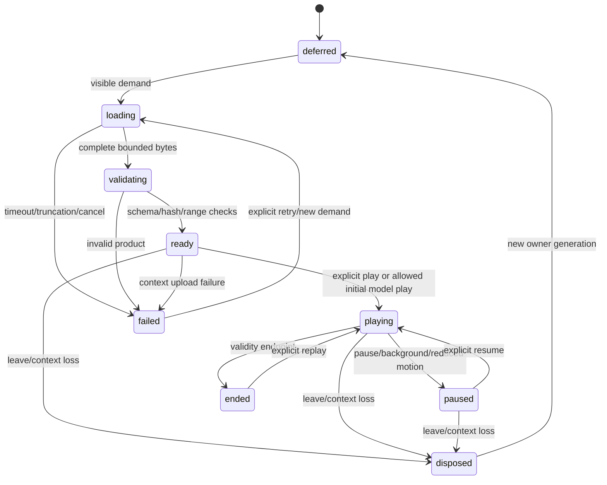

# Developer experience and data contracts

All names in the **new** sections are proposed interfaces to implement. Existing snapshot v3, `simulate`/`result_len`, existing appearance v1 and public navigation remain compatible. Native ES modules, WebGL2, npm, dependency-free Rust and the existing Python tooling remain the baseline.

## 1. New contract families

### `solar-observation-sequence.v1`

Manifest fields:

```text
schema_version, id, recipe_version, source_manifest_sha256
mission, instrument, channel_id, wavelength_angstrom
intensity_kind: provider_display | exposure_normalized_counts | calibrated_radiance
intensity_units, display_transfer_id, calibration_id (nullable)
observer, coordinate_system, registration_recipe, valid_time_range
frames[]: id, observed_at, exposure_seconds (nullable), quality_raw,
  quality_interpretation, source_sha256, metadata_sha256,
  asset_path, bytes, sha256, width, height, coverage_mask_path,
  wcs, gap_before_seconds, permitted_interpolation
credits, source_urls, limitations, original_time_scale
```

Requirements: strict version/key validation; ordered unique times and IDs; finite geometry; explicit missing exposure/calibration; observation time is never download time. Never treat a JP2 browse value as linear radiance. The first provider-display sequence uses original/provider-declared stretches and is reviewed for flicker; an unknown per-frame transfer blocks quantitative intensity comparisons. Exposure-normalized/calibrated sequences require a separate source-quality and calibration recipe.

Initial archive pack target: one channel, two hours at approximately one-minute sampling, at most 121 preview frames at 512 pixels plus selectively loaded 1024-pixel frames. This is an engineering budget, not a cadence guarantee; source timestamps govern. A fast event clip requires denser sampling and a shorter interval, not synthetic inserted observations. Use a maximum three-frame decoded ring plus current/next GPU textures. No whole-movie preload. Default gap rule: stop/hold at a missing interval over two expected cadences and display the actual gap; never interpolate through an eclipse, invalid-quality frame, flare-exposure discontinuity or unqualified registration change.

### `solar-dynamic-appearance.v1`

```text
schema_version, scenario_id, recipe_version, generator_source_sha256
source_snapshot_schema, source_snapshot_sha256 (nullable), seed_u32
authority: illustrative | simulation_derived
valid_time_range_seconds, epoch_label, epoch_time_scale
frame: heliographic_carrington, longitude_positive: west, north_axis: z
solar_radius_m, source_reference_radius_m (nullable)
rotation_law: id, coefficients_deg_per_day, frame_rate_deg_per_day
field_units: normalized | tesla, field_provenance
plasma_authority: illustrative | simulation_derived, parameter_metadata[]
channels[]: id, response_kind, response_hash (nullable), intensity_units, palette_id
surface_recipe, strand_recipe, volume_recipe, event_catalogue
quality_variants[]: id, dimensions, resources[], required_capabilities, max_bytes
keyframes[]: time_seconds, geometry_id, topology_id, resource_ids, transition_kind
dependencies[], credits, limitations, numerical_validation_id
```

Each resource declares path, bytes, SHA-256, decoded dimensions, dtype, component layout, byte order, spatial extent, interpolation/filtering rules, valid range, units and coverage. Separate source/model content from palette/exposure/bloom. Reject a model claiming `observed` authority: observations use the distinct sequence schema. Physical-unit labels require matching admitted provenance, not just a non-null field.

Initial scalar volume layout is little-endian interleaved float32 on disk, converted to RGBA16F after range/error checks: normalized density, model log10 temperature in K, cool-material absorption per solar radius, and dimensionless heating modulation. Optional compression is an offline/server transport concern, not a new browser decompression package. Byte admission counts decoded size before allocation. If half-float error exceeds the channel recipe's tolerance, reject that variant or provide a qualified alternative.

The first mobile pack may use a time-averaged diffuse background plus time-varying strand/region descriptors. Its label must not imply the background is a time-resolved plasma solution. Complete time-varying volumes are optional products admitted under the same budget; they are not required for continuous local motion.

### `solar-render-packet.v1`

Per-frame worker result with `release`, `engine_hash`, `abi`, `recipe_hash`, `scenario_id`, `generation`, `serial`, requested and admitted scenario times, interpolation interval/fraction, `topology_id`, resource identities, posed surface regions, strand segment descriptors, event state, granulation evaluation parameters, channel transfer ID, quality tier and capability/degraded reason.

Transfer large numeric arrays using ArrayBuffers with fixed documented layouts and validate lengths before publication. The JSON header provides identity/units; it must not contain a huge numeric-grid copy. Every array is finite and read-only by ownership convention after transfer. Do not detach a buffer still in use by the currently displayed packet. GPU upload consumes an admitted packet once per generation/serial.

## 2. Rust and WASM boundary

Add `crates/solar-core/src/appearance/` with:

- `mod.rs`, `recipe.rs`, `time.rs`, `surface.rs`, `granulation.rs`, `events.rs`, `transfer.rs`, `pfss.rs`, `field_lines.rs`, `packet.rs`.
- Pure APIs: `sample_appearance(recipe, scenario_time, quality) -> Result<AppearanceDescriptor, AppearanceError>`, `solve_pfss(boundary, config) -> Result<FieldSolution,...>`, `trace_field_lines(solution,seeds,limits)`, and CPU `integrate_transfer(ray,field,limits)` reference.
- Appearance sampling never mutates `SolarState`; a caller supplies or references accepted model snapshots. Preserve `advance_flux_transport` and its existing event/checkpoint semantics.

Extend `solar-cli` with an offline `appearance` subcommand family using the repository's existing parser conventions. `prepare` reads a local strict recipe and optional source snapshot sequence; `validate` checks products; `sample` emits a diagnostic packet at one target time. No HTTP is performed by these commands. Exit 0 success, 1 processing/validation failure, 2 argument errors. Use new output directories, fail if a destination exists with different content, and support a byte-identical replay as a verified no-op.

Initial additive WASM exports:

```text
appearance_abi_version() -> u32        // 1
appearance_eval_v1(seed:u32, time_s:f64, recipe_id:u32, lod:u32) -> pointer
appearance_result_len_v1() -> usize
```

For ABI v1, `recipe_id` selects only build-pinned appearance recipes, whose hashes are published in engine metadata and required by the bundle. The function evaluates compact analytic microstructure/event descriptors; it does not recompute global PFSS, import arbitrary URLs, or accept user pointers. Output has a 1 MiB hard cap and returns a typed error document on unsupported ID, bounds or capacity failure. The dedicated result buffer is valid until the next appearance call. Copy bytes before another call or memory growth; never retain a stale JS view. Existing `simulate` output semantics are unchanged. Custom recipe ingestion is a later ABI revision, not an undocumented extension.

Browser keyframe/geometry interpolation remains a rendering transform over accepted offline products. Its equations have Rust reference tests; it does not create authoritative field extrapolations. For every packet, the analytic descriptor recipe, offline scenario recipe, source snapshot identity and worker release must agree.

## 3. Browser module boundaries

New modules (native `.js` with checked JSDoc):

| Module | Responsibility |
|---|---|
| `solarDynamicContract.js` | Strict schema/semantic validation and generated contract constants. |
| `solarDynamicAssets.js` | Bounded same-origin loads, digests, decoded layout, variant admission. |
| `solarDynamicWorker.js` / `solarDynamicWorkerClient.js` | Dedicated bounded latest-intent sampling; optional appearance WASM initialization. |
| `solarDynamicClock.js` | Pure pause/rate/seek/background state transitions and canonical scenario time. |
| `solarDynamicRenderer.js` | Context-owned resources, surface/emission passes, frame identity and teardown. |
| `solarSurfaceShaders.js` / `solarAtmosphereShaders.js` | Pure rendering evaluation, no state-estimator mutation. |
| `solarDynamicControls.js` | Mode/channel/time/layers UI and accessibility state. |
| `solarSequencePlayer.js` | Source-index selection, frame-ring loading, gaps and ended state. |
| `solarBloom.js` | Optional bounded glow targets and explicit disposal; no physics quantities. |

Integrate via narrow calls in `orrery.js`, `solarObservation.js`, `destinationCards.js`, and `render.js`. Keep one authoritative scene-state object in existing store conventions; do not create duplicate independent clocks in controls, renderer and worker.

## 4. Resource lifecycle and failure contract



Keep last verified pixels with an explicit stale/paused reason on replacement failure. Do not advance the displayed timestamp while holding an old frame. Cancellation releases stream readers, ImageBitmaps, worker-owned arrays and pending uploads. Late completions check mode, scenario, generation, serial and context owner before touching state. One active preparation request per worker; only one queued latest intent; obsolete work is canceled/worker-restarted within established limits. No unbounded retry loop.

Admission targets: manifest ≤1 MiB; ≤2 concurrent asset requests; per-request timeout 15 seconds; first useful low-tier model transfer ≤12 MiB; higher-quality optional products load on demand. Initial bundled scene duration 6 hours with 15-minute geometry keyframes (25 keys) and analytic fast local evolution; a rotation lesson uses a separate longer-lived scenario. Keyframe spacing is a proposed geometry cadence, not the timestep of a plasma solver. Stop at validity limits. A changing camera cannot trigger new network requests every frame.

Reject path traversal, cross-origin/redirected resources, MIME/size mismatch, decompression overflow, duplicate keys/IDs, nonfinite fields, unsupported versions, incompatible timestamps and generation mismatches. Hashes establish integrity and identity, not scientific accuracy. No telemetry upload, secrets, local path leakage, arbitrary shader source from manifests, or execution of dataset-provided scripts.

## 5. Build and contributor workflow

Schemas: `docs/solar-observation-sequence-v1.schema.json`, `docs/solar-dynamic-appearance-v1.schema.json`, `docs/solar-render-packet-v1.schema.json`. Generated browser schema metadata comes from these exact files; no handwritten divergent copy. Extend `tools/build_web.py`, `tools/validate_physical_assets.py`, build/release classification and service-worker asset enumeration to include all new runtime modules and products. Preserve strict v1 appearance validation as a distinct dispatch branch.

Preparation scripts planned: `tools/prepare_solar_sequence.py`, `tools/prepare_solar_dynamic.py`, `tools/validate_solar_dynamic.py`. Each accepts local immutable inputs and explicit output; optional acquisition lives in the existing source-acquisition architecture, never in browser rendering. Include versions, inputs, parameter hashes, byte counts, derivations and limitations in output receipts. Failed preparation never promotes a partial directory.

No new mandatory npm/Cargo dependency is planned. FITS, instrument calibration, OpenVDB and Blender integrations may require an optional offline authoring environment. Inventory and pin that environment separately before use; do not install SunPy/CHIANTI/pfsspy into the application by implication. The default plan can proceed with existing admitted display sequences, dependency-free reduced models and Blender's built-in Python once installed.
